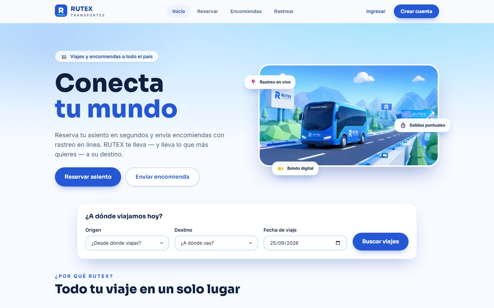
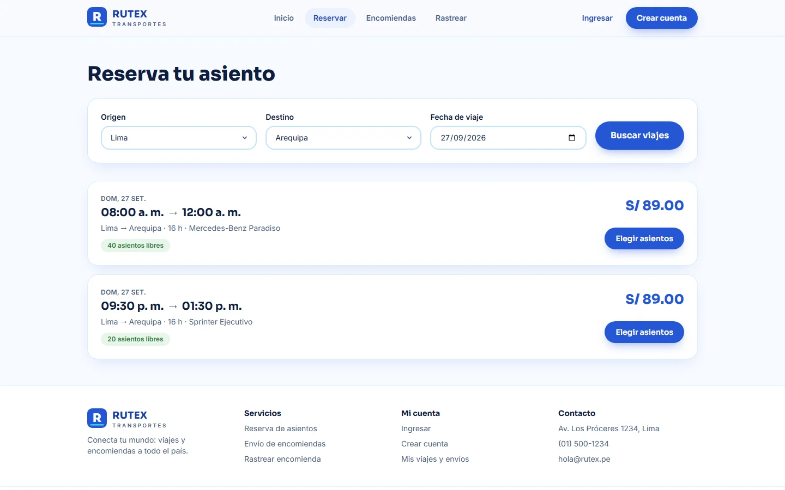
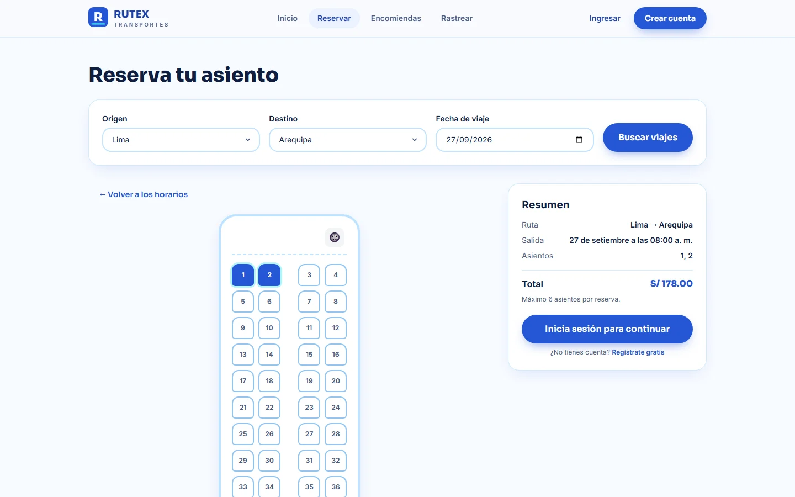
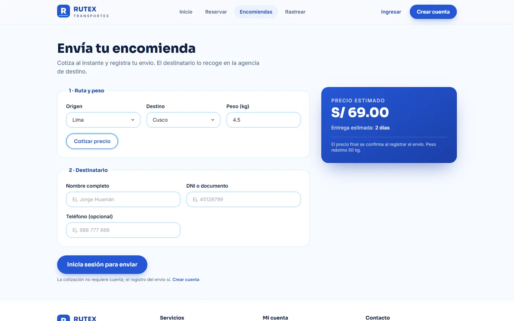
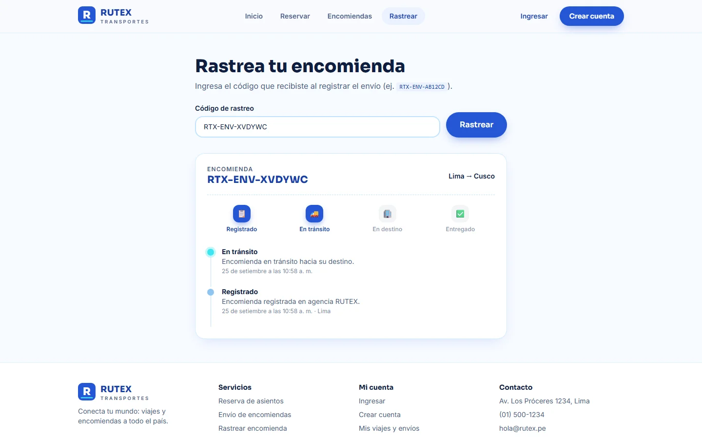
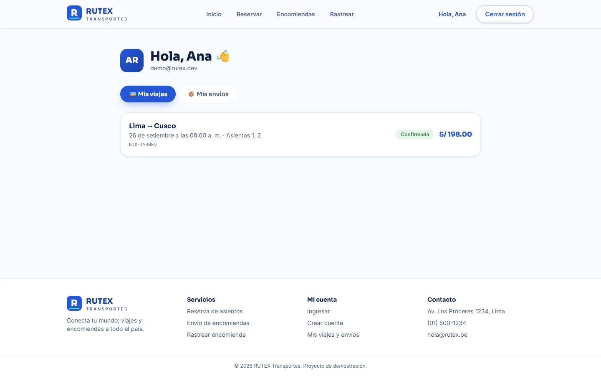
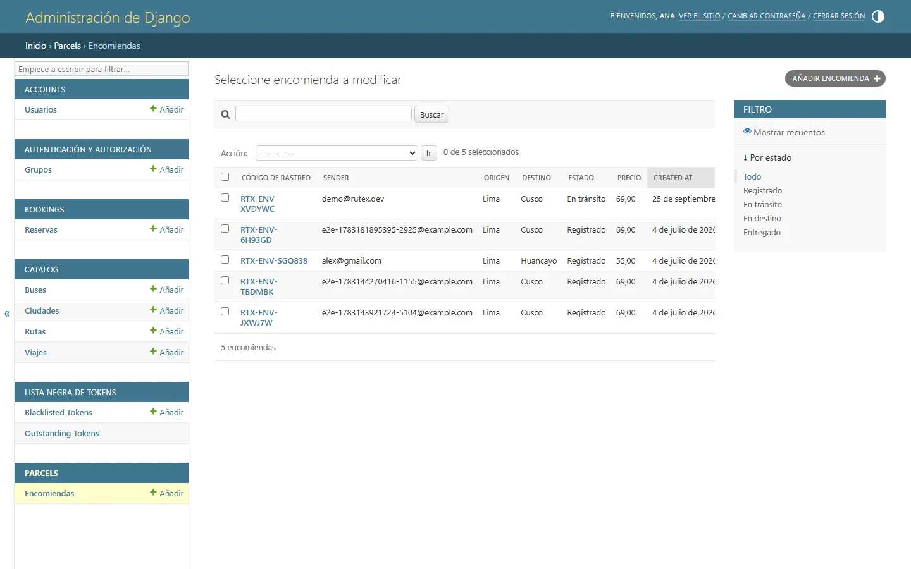

<div align="center">

# 🚌 RUTEX Transportes

**Reserva de asientos y envíos de encomiendas con rastreo público**

Aplicación web full-stack en español, construida como pieza de portafolio.

[](https://github.com/Alex350-coder/TransportApp/actions/workflows/ci.yml)
[](LICENSE)


</div>

---

## Vista previa

<div align="center">
  
  <sub>Landing: hero con animación de buses, rutas populares y acceso a los dos flujos de negocio.</sub>
</div>

## Capturas de pantalla

<table>
  <tr>
    <td width="50%"></td>
    <td width="50%"></td>
  </tr>
  <tr>
    <td align="center"><sub>1 · Búsqueda de viajes con disponibilidad en tiempo real</sub></td>
    <td align="center"><sub>2 · Plano de asientos con selección múltiple</sub></td>
  </tr>
  <tr>
    <td width="50%"></td>
    <td width="50%"></td>
  </tr>
  <tr>
    <td align="center"><sub>3 · Cotización de encomienda por peso y distancia</sub></td>
    <td align="center"><sub>4 · Rastreo público sin necesidad de cuenta</sub></td>
  </tr>
  <tr>
    <td width="50%"></td>
    <td width="50%"></td>
  </tr>
  <tr>
    <td align="center"><sub>5 · "Mi cuenta": viajes reservados y envíos registrados</sub></td>
    <td align="center"><sub>6 · Back-office en Django Admin con avance de estado de encomiendas</sub></td>
  </tr>
</table>

## Qué resuelve

| Flujo | Descripción |
|---|---|
| 🪑 **Reserva de asientos** | Búsqueda por origen/destino/fecha, selección de hasta 6 asientos en el plano real del bus, datos de pasajeros y ticket con código único. |
| 📦 **Envío de encomiendas** | Cotización instantánea por peso y distancia, registro con código de rastreo `RTX-ENV-XXXXXX` y ciclo de vida de 4 estados. |
| 🔎 **Rastreo público** | Timeline de eventos accesible sin cuenta y **sin exponer datos del remitente ni del destinatario**. |
| 👤 **Cuentas** | Registro/login por correo, panel "Mi cuenta" con historial paginado de viajes y envíos. |
| 🛠 **Back-office** | Django Admin para operar rutas, buses, viajes y encomiendas, con acción masiva para avanzar el estado de un envío. |

## Stack

| Capa | Tecnologías |
|---|---|
| **Frontend** | React 19 · Vite 8 · TypeScript 6 · Tailwind CSS v4 · Motion (Framer Motion) · TanStack Query v5 · React Router v8 · React Hook Form + Zod 4 |
| **Backend** | Django 5.2 · Django REST Framework · SimpleJWT (con blacklist) · drf-spectacular · django-cors-headers |
| **Base de datos** | SQLite por defecto en desarrollo · PostgreSQL 16 vía Docker |
| **Calidad** | pytest + pytest-cov · Vitest + Testing Library · Playwright (E2E) · oxlint · GitHub Actions |

## Puesta en marcha

**Requisitos:** Python 3.12+ · Node 20+ · pnpm · Docker (opcional, solo para PostgreSQL).

```bash
# 1) Variables de entorno
cp .env.example .env

# 2) Backend
cd backend
python -m venv .venv
.venv/Scripts/pip install -r requirements.txt      # Unix: .venv/bin/pip install -r requirements.txt
.venv/Scripts/python manage.py migrate
.venv/Scripts/python manage.py seed_demo           # 10 ciudades, 20 rutas, 5 buses y 14 días de viajes
.venv/Scripts/python manage.py createsuperuser     # para operar en /admin
.venv/Scripts/python manage.py runserver           # http://localhost:8000

# 3) Frontend (en otra terminal)
cd frontend
pnpm install
pnpm dev                                           # http://localhost:5173
```

| URL | Contenido |
|---|---|
| `http://localhost:5173` | Aplicación web |
| `http://localhost:8000/api/docs/` | Swagger UI (OpenAPI, solo en desarrollo) |
| `http://localhost:8000/admin/` | Back-office de operaciones |

<details>
<summary>¿Prefieres PostgreSQL 16?</summary>

```bash
docker compose up -d
# y en .env:  DATABASE_ENGINE=postgres
```

`docker-compose.yml` solo levanta la base de datos; el backend y el frontend se ejecutan desde tu máquina.
</details>

<details>
<summary>Variables de entorno relevantes</summary>

| Variable | Por defecto | Para qué sirve |
|---|---|---|
| `DJANGO_SECRET_KEY` | — | **Obligatoria en producción**: el servidor no arranca sin ella. |
| `DJANGO_DEBUG` | `True` | Con `False` se activan headers de seguridad y se oculta `/api/docs/`. |
| `DATABASE_ENGINE` | `sqlite` | `postgres` para usar el servicio de `docker-compose.yml`. |
| `FRONTEND_ORIGIN` | `http://localhost:5173` | Única origen permitido por CORS. |
| `VITE_API_BASE_URL` | `http://localhost:8000/api/v1` | Base de la API que consume el frontend. |
</details>

## API

Todas las rutas viven bajo `/api/v1/` y responden con un envelope uniforme:

```json
{ "success": true, "data": {}, "error": null }
```

Los errores usan códigos estables en inglés y mensajes en español:

```json
{ "success": false, "data": null, "error": { "detail": "…", "code": "seat_taken", "fields": {} } }
```

| Método | Endpoint | Auth | Descripción |
|---|---|:--:|---|
| `GET` | `/cities/` | — | Ciudades disponibles |
| `GET` | `/trips/` | — | Búsqueda paginada de viajes programados |
| `GET` | `/trips/{id}/seats/` | — | Plano del bus y asientos ocupados |
| `POST` | `/auth/register/` | — | Crear cuenta |
| `POST` | `/auth/token/` | — | Login (JWT) |
| `POST` | `/auth/token/refresh/` | — | Renovar access token |
| `GET` | `/auth/me/` | ✅ | Perfil del usuario actual |
| `POST` | `/bookings/` | ✅ | Crear reserva (transaccional) |
| `GET` | `/bookings/mine/` | ✅ | Historial paginado de reservas |
| `GET` | `/bookings/{code}/` | ✅ | Detalle de una reserva propia |
| `POST` | `/parcels/quote/` | — | Cotizar sin persistir |
| `POST` | `/parcels/` | ✅ | Registrar encomienda |
| `GET` | `/parcels/mine/` | ✅ | Historial paginado de envíos |
| `GET` | `/parcels/track/{code}/` | — | Rastreo público por código |

Las listas paginadas devuelven `{ "items": [...], "meta": { "total", "page", "pages", "page_size" } }`.

## Decisiones de arquitectura

```
frontend/  ──HTTP + JWT──▶  backend/  ──▶  ORM Django  ──▶  SQLite | PostgreSQL
   SPA React                    DRF + apps por dominio
```

- **Dominio divided por apps**: `core` (envelope, paginación, throttling), `accounts`, `catalog`, `bookings`, `parcels`. La lógica de negocio vive en `services.py` y las consultas en `selectors.py`, no en las vistas.
- **Cero doble reserva**: el asiento se bloquea con `select_for_update()` dentro de una transacción y, como última línea de defensa, existe el constraint `UNIQUE(trip, seat_number)` en la base de datos. Un conflicto devuelve `409 seat_taken`.
- **Aislamiento de recursos**: el detalle de una reserva se filtra siempre por el usuario autenticado; otro usuario recibe `404`, no `403`, para no revelar que el recurso existe.
- **Rastreo sin fuga de datos**: el serializer público expone código, estado, ruta y eventos; nunca remitente ni datos de contacto del destinatario.
- **Sesión JWT**: access token de 30 min + refresh de 7 días con rotación y blacklist; el cliente renueva una sola vez ante un `401` y limpia la sesión si el refresh falla.
- **Rate limiting** por scope: anónimos `60/min`, usuarios `120/min`, `auth` `10/min`, `tracking` `30/min`.
- **Frontend por features** (`components/booking`, `components/parcels`, `components/landing`, `ui/` como primitivas) con design tokens en `frontend/src/styles/tokens.css`; la landing se carga de forma eager por LCP y el resto de páginas con `React.lazy`.
- **Polling e invalidación**: el mapa de asientos se refresca cada 20 s y se invalida al crear una reserva o recibir un `409`.
- **Activos de marca**: los frames originales viven en `Frames/` y se sirven como WebP optimizados desde `frontend/public/img/` (`frontend/scripts/optimize-images.mjs`).

## Tests y calidad

| Suite | Cobertura | Comando |
|---|---|---|
| Backend | **38 tests** (accounts 9 · bookings 10 · catalog 8 · parcels 11) | `python -m pytest` |
| Backend + cobertura | umbral de **80 %** en CI | `python -m pytest --cov=apps` |
| Frontend | **82 tests** en 17 archivos (Vitest + Testing Library) | `pnpm test` |
| E2E | 3 specs (landing, reserva completa, encomienda + tracking) | `pnpm e2e` |
| Lint / tipos | oxlint + `tsc -b` | `pnpm lint` · `pnpm build` |

```bash
# Backend (desde backend/)
.venv/Scripts/python -m pytest
.venv/Scripts/python -m pytest --cov=apps

# Frontend (desde frontend/)
pnpm test
pnpm e2e        # Playwright levanta el backend y el frontend por su cuenta
pnpm lint
pnpm build      # typecheck + build de producción
```

**CI** (`.github/workflows/ci.yml`) corre en cada push y PR: `pytest --cov=apps --cov-fail-under=80` en Python 3.12 y `oxlint + vitest + build` en Node. Los E2E quedan fuera de CI de forma intencionada: el `webServer` de Playwright asume el entorno local de desarrollo.

## Seguridad

- **Aplicado**: rotación de refresh tokens **con blacklist**; throttling global y por scope; `SECRET_KEY` obligatoria en producción (el arranque falla si falta); Swagger y `/api/schema/` expuestos **solo** con `DEBUG`; CORS limitado a `FRONTEND_ORIGIN`; validación del parámetro `next` del frontend (solo rutas internas); headers de seguridad en `prod.py` (HSTS, `nosniff`, `X-Frame-Options: DENY`, referrer policy); validación de contraseñas de Django.
- **Tradeoff aceptado para la demo**: el JWT se guarda en `localStorage`, mitigado por la corta vida del access token (30 min) y la rotación con blacklist.
- **Pendiente antes de un uso real**: protección de fuerza bruta en el login de `/admin/`, `SECURE_PROXY_SSL_HEADER` según el proxy y `CSRF_TRUSTED_ORIGINS` si el admin se sirve desde otro origen.

## Estructura del repositorio

```
.
├── backend/                  # Django + DRF
│   ├── apps/
│   │   ├── core/             # envelope, errores, paginación, throttles
│   │   ├── accounts/         # usuario custom (login por correo) + JWT
│   │   ├── catalog/          # ciudades, rutas, buses, viajes
│   │   ├── bookings/         # reservas + invariante de asientos
│   │   └── parcels/          # encomiendas + timeline de rastreo
│   ├── config/settings/      # base · dev · prod · test
│   └── manage.py
├── frontend/                 # React + Vite + TypeScript
│   ├── src/
│   │   ├── components/       # por feature + ui/ (primitivas)
│   │   ├── pages/            # rutas de la SPA
│   │   ├── hooks/            # capa de datos (TanStack Query)
│   │   ├── lib/              # api-client, auth-context, format, motion
│   │   ├── styles/           # tokens.css (fuente de verdad del diseño)
│   │   └── test/             # setup y fixtures
│   ├── e2e/                  # specs de Playwright
│   └── public/img/           # marca optimizada en WebP
├── docs/screenshots/         # capturas de este README
├── Frames/                   # arte de marca original
├── docker-compose.yml        # PostgreSQL 16
└── .github/workflows/ci.yml
```

## Fuera de alcance (por diseño)

Es un **prototipo**, no un sistema de producción. Queda pendiente a propósito:

- **Pagos simulados**: la reserva nace directamente en estado `confirmed`, sin pasarela.
- **Sin notificaciones**: no hay correos ni SMS de confirmación o de estado de envío.
- **Sin roles ni multi-oficina**: el back-office es el Django Admin estándar.
- **E2E en un solo navegador**: Playwright está configurado para Chromium.
- **Sin i18n**: la interfaz es solo en español.

## Sobre este proyecto

**ES** — Prototipo personal creado como pieza de portafolio para reclutadores de desarrollo de software. Fue construido **con asistencia de IA** (Claude Code), guiado por prompts iterativos, y complementado con **pruebas manuales** y las suites automatizadas del repositorio. El objetivo es mostrar arquitectura full-stack, disciplina de testing y un flujo de desarrollo asistido por IA.

**EN** — Personal prototype built as a portfolio piece for software development recruiters, created **with AI assistance** (Claude Code) and complemented with **manual testing** plus the automated suites in this repository. Payments are simulated and there are no email/SMS notifications: it is a demonstration of full-stack architecture, testing discipline and an AI-assisted development workflow — not a production system.

## Licencia

MIT © 2026 Ander Alexander Aguirre Tejada · [LICENSE](LICENSE)
